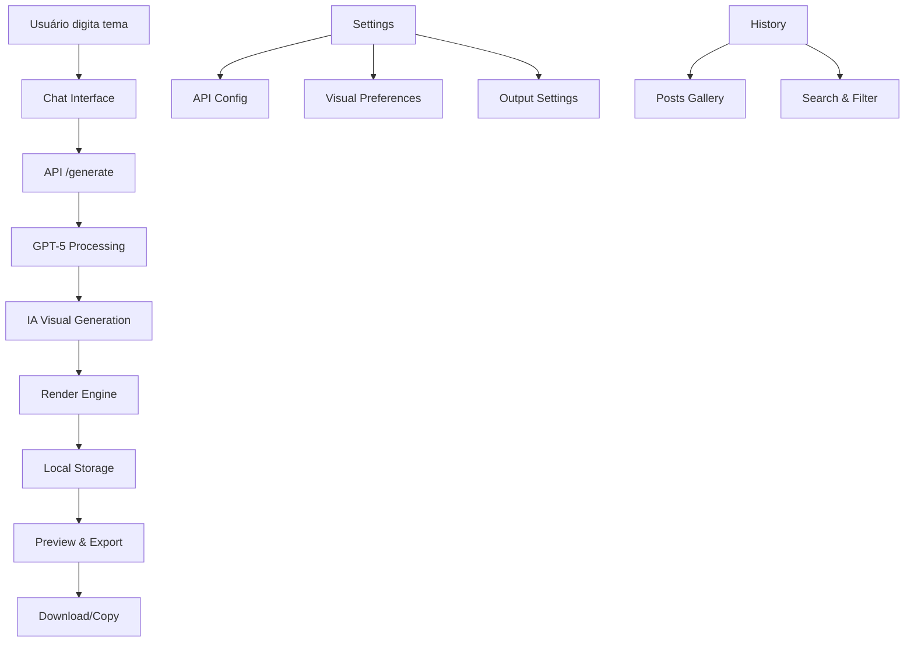

# Nottu PostMaker - Documento de Requisitos do Produto (PRD)

## 1. Product Overview

O **Nottu PostMaker** é um gerador de criativos com IA de nível agência que combina GPT-5, IA visual e renderização local para criar posts únicos para redes sociais com a identidade visual da Nottu Tech.

- **Problema a resolver**: Automatizar a criação de posts profissionais para redes sociais, eliminando a necessidade de designers e redatores para conteúdo de rotina.
- **Público-alvo**: Equipe interna da Nottu Tech e futuramente clientes que precisam de conteúdo visual consistente e de alta qualidade.
- **Valor de mercado**: Redução de 80% no tempo de criação de posts, mantendo qualidade profissional e identidade visual consistente.

## 2. Core Features

### 2.1 User Roles

| Role | Registration Method | Core Permissions |
|------|---------------------|------------------|
| Usuário Interno | Acesso direto (aplicação local) | Pode gerar posts, visualizar histórico, configurar preferências |
| Admin | Configuração inicial | Pode gerenciar configurações da aplicação, chaves de API, e configurações visuais |

### 2.2 Feature Module

Nossa aplicação consiste nas seguintes páginas principais:

1. **Chat Interface**: interface principal estilo ChatGPT, input de tema, histórico de conversas, área de preview.
2. **Preview & Export**: visualização do post gerado, legenda, hashtags, opções de download e cópia.
3. **Settings**: configuração de chaves API, preferências de IA visual, configurações de output.
4. **History**: histórico de posts gerados, busca e filtros, re-download de posts anteriores.

### 2.3 Page Details

| Page Name | Module Name | Feature description |
|-----------|-------------|---------------------|
| Chat Interface | Input Area | Campo de texto para inserir tema do post, botão de envio, indicador de processamento |
| Chat Interface | Conversation History | Lista de mensagens do usuário e respostas da IA, scroll infinito, timestamps |
| Chat Interface | Live Preview | Área de preview em tempo real do post sendo gerado, loading states |
| Preview & Export | Post Visualization | Exibição do post final em alta resolução, zoom e pan |
| Preview & Export | Content Display | Mostrar legenda gerada, lista de hashtags, metadados do post |
| Preview & Export | Export Options | Download PNG, copiar legenda, copiar hashtags, salvar em pasta personalizada |
| Settings | API Configuration | Campos para OpenAI API key, seleção de provider de IA visual (DALL·E/Flux/Leonardo) |
| Settings | Visual Preferences | Configurações de tipografia, cores, layout templates, logo positioning |
| Settings | Output Settings | Configuração de pasta de destino, formato de nomeação, qualidade de imagem |
| History | Posts Gallery | Grid de posts gerados anteriormente, filtros por data e tema |
| History | Search & Filter | Busca por texto, filtros por período, provider de IA usado |
| History | Batch Operations | Seleção múltipla, re-download, exportação em lote |

## 3. Core Process

### Fluxo Principal do Usuário

1. **Usuário acessa a Chat Interface** e digita o tema desejado para o post
2. **Sistema processa o tema** enviando para GPT-5 que gera título, conteúdo, legenda, hashtags e prompt visual
3. **IA Visual gera imagem** usando o prompt criado pelo GPT-5 (DALL·E 3, Flux.1 ou Leonardo)
4. **Render Engine compõe o layout** aplicando texto, logo Nottu e elementos visuais usando Puppeteer/Satori
5. **Post é salvo localmente** na estrutura C:/NottuPosts/YYYY-MM-DD/ com PNG, caption, hashtags e metadata
6. **Preview é exibido** na interface com opções de download, cópia e compartilhamento

### Fluxo de Configuração (Admin)

1. **Admin acessa Settings** para configurar chaves de API necessárias
2. **Configura preferências visuais** definindo templates, cores e tipografias
3. **Define configurações de output** como pasta de destino e qualidade

## 4. User Interface Design

### 4.1 Design Style

- **Cores primárias**: Fundo escuro (#0A0A0F), Roxo neon (#4E3FE2), Branco (#FFFFFF)
- **Cores secundárias**: Cinza escuro (#1A1A1F), Cinza médio (#2A2A2F), Roxo claro (#6E5FE2)
- **Estilo de botões**: Rounded corners (8px), gradiente roxo, hover com glow effect
- **Tipografia**: 
  - Títulos: Orbitron (peso 700, tamanhos 24px-32px)
  - Corpo: JetBrains Mono (peso 400, tamanhos 14px-16px)
  - Interface: IBM Plex Sans (peso 400-600, tamanhos 12px-18px)
- **Layout**: Chat-like interface inspirada no ChatGPT, sidebar para navegação, área principal fluida
- **Ícones**: Lucide React com estilo outline, cor roxo neon para estados ativos

### 4.2 Page Design Overview

| Page Name | Module Name | UI Elements |
|-----------|-------------|-------------|
| Chat Interface | Input Area | Input field com border roxo neon, botão circular com ícone de envio, placeholder animado |
| Chat Interface | Conversation History | Bolhas de mensagem alternadas (usuário: direita/roxo, IA: esquerda/cinza), timestamps discretos |
| Chat Interface | Live Preview | Card com border gradient, loading skeleton, preview em tempo real com fade-in |
| Preview & Export | Post Visualization | Modal fullscreen com fundo escuro, controles de zoom, close button com X |
| Preview & Export | Content Display | Cards separados para legenda e hashtags, copy buttons com feedback visual |
| Preview & Export | Export Options | Botões com ícones (download, copy, folder), tooltips explicativos |
| Settings | API Configuration | Input fields com validação visual, toggle switches para providers |
| Settings | Visual Preferences | Color pickers, font selectors, preview em tempo real das mudanças |
| History | Posts Gallery | Grid responsivo 3-4 colunas, hover effects com overlay de ações |
| History | Search & Filter | Search bar com ícone de lupa, dropdown filters, clear filters button |

### 4.3 Responsiveness

- **Desktop-first approach** otimizado para telas 1920x1080 e superiores
- **Tablet adaptation** com sidebar colapsável e grid responsivo
- **Mobile considerations** com navegação bottom-tab e interface touch-friendly
- **Breakpoints**: Desktop (1200px+), Tablet (768px-1199px), Mobile (320px-767px)