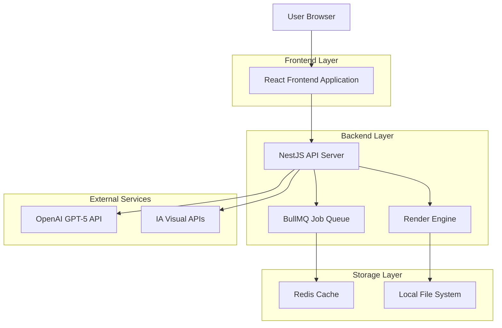
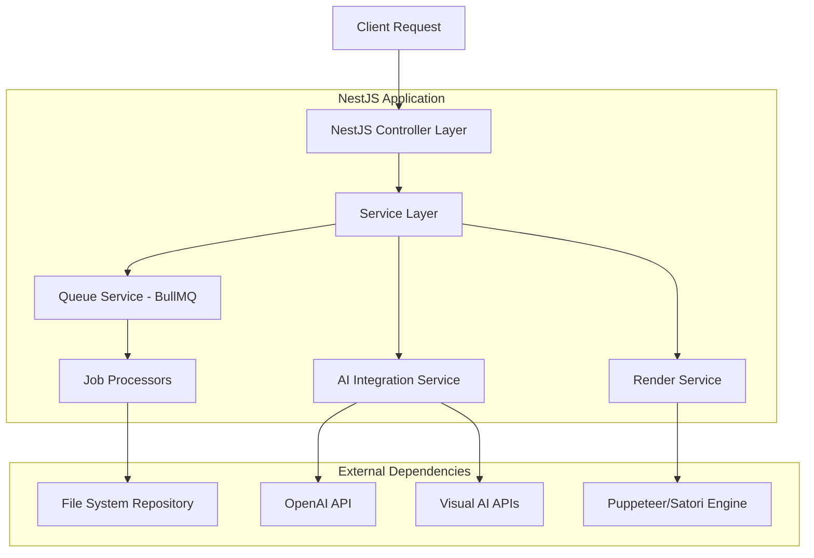
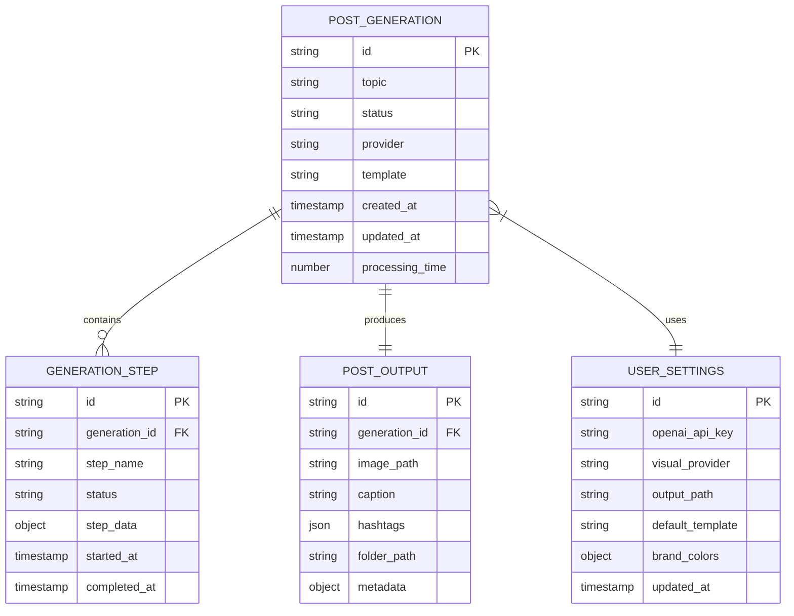

# Nottu PostMaker - Documento de Arquitetura Técnica

## 1. Architecture Design



## 2. Technology Description

- **Frontend**: React@18 + Vite@5 + TailwindCSS@3 + Framer Motion@11 + Lucide React
- **Backend**: NestJS@10 + Fastify@4 + BullMQ@5 + Redis@7
- **Render Engine**: Puppeteer@21 + Satori@0.10 + Resvg@2 + Sharp@0.33
- **AI Integration**: OpenAI SDK@4 + Custom adapters for Flux.1/Leonardo
- **Development**: TypeScript@5 + Nx@17 + ESLint@8 + Prettier@3
- **Deployment**: Docker + Docker Compose

## 3. Route Definitions

| Route | Purpose |
|-------|---------|
| / | Chat interface principal, input de tema e histórico de conversas |
| /preview/:id | Página de preview detalhado do post gerado com opções de export |
| /settings | Configurações de API keys, preferências visuais e output |
| /history | Galeria de posts gerados anteriormente com busca e filtros |
| /api/generate | Endpoint principal para geração de posts |
| /api/history | Endpoint para recuperar histórico de posts |
| /api/settings | Endpoint para gerenciar configurações do usuário |

## 4. API Definitions

### 4.1 Core API

**Geração de Posts**
```
POST /api/generate
```

Request:
| Param Name | Param Type | isRequired | Description |
|------------|------------|------------|-------------|
| topic | string | true | Tema ou descrição do post desejado |
| provider | string | false | Provider de IA visual (dalle, flux, leonardo) |
| template | string | false | Template de layout a ser usado |

Response:
| Param Name | Param Type | Description |
|------------|------------|-------------|
| id | string | ID único da geração |
| status | string | Status do processamento (processing, completed, error) |
| imageUrl | string | URL local da imagem gerada |
| caption | string | Legenda gerada pelo GPT-5 |
| hashtags | string[] | Array de hashtags relevantes |
| folder | string | Caminho da pasta onde foi salvo |
| metadata | object | Metadados da geração (timestamp, provider usado, etc.) |

Example Request:
```json
{
  "topic": "Criar um criativo sobre por que escolher a Nottu Tech para automação empresarial",
  "provider": "flux",
  "template": "default"
}
```

Example Response:
```json
{
  "id": "gen_20250126_001",
  "status": "completed",
  "imageUrl": "C:/NottuPosts/2025-01-26/post_001.png",
  "caption": "🚀 Por que escolher a Nottu Tech? Transformamos processos complexos em soluções simples e eficientes. Nossa automação inteligente libera sua equipe para focar no que realmente importa: crescer seu negócio.",
  "hashtags": ["#NottuTech", "#Automacao", "#Inovacao", "#Tecnologia", "#Eficiencia"],
  "folder": "C:/NottuPosts/2025-01-26",
  "metadata": {
    "timestamp": "2025-01-26T10:30:00Z",
    "provider": "flux",
    "template": "default",
    "processingTime": 45.2
  }
}
```

**Histórico de Posts**
```
GET /api/history
```

Query Parameters:
| Param Name | Param Type | isRequired | Description |
|------------|------------|------------|-------------|
| page | number | false | Número da página (default: 1) |
| limit | number | false | Itens por página (default: 20) |
| search | string | false | Busca por texto no tema ou legenda |
| dateFrom | string | false | Data inicial (ISO format) |
| dateTo | string | false | Data final (ISO format) |

**Configurações**
```
GET/PUT /api/settings
```

Settings Object:
| Param Name | Param Type | Description |
|------------|------------|-------------|
| openaiApiKey | string | Chave da API OpenAI |
| visualProvider | string | Provider padrão (dalle, flux, leonardo) |
| outputPath | string | Caminho de saída dos posts |
| defaultTemplate | string | Template padrão de layout |
| brandColors | object | Cores personalizadas da marca |

## 5. Server Architecture Diagram



## 6. Data Model

### 6.1 Data Model Definition



### 6.2 Data Definition Language

**Post Generation Table**
```sql
-- Tabela principal de gerações
CREATE TABLE post_generations (
    id VARCHAR(50) PRIMARY KEY,
    topic TEXT NOT NULL,
    status VARCHAR(20) DEFAULT 'pending' CHECK (status IN ('pending', 'processing', 'completed', 'error')),
    provider VARCHAR(20) DEFAULT 'dalle' CHECK (provider IN ('dalle', 'flux', 'leonardo')),
    template VARCHAR(50) DEFAULT 'default',
    created_at TIMESTAMP WITH TIME ZONE DEFAULT NOW(),
    updated_at TIMESTAMP WITH TIME ZONE DEFAULT NOW(),
    processing_time DECIMAL(10,2),
    error_message TEXT
);

-- Tabela de etapas de processamento
CREATE TABLE generation_steps (
    id UUID PRIMARY KEY DEFAULT gen_random_uuid(),
    generation_id VARCHAR(50) REFERENCES post_generations(id) ON DELETE CASCADE,
    step_name VARCHAR(50) NOT NULL,
    status VARCHAR(20) DEFAULT 'pending',
    step_data JSONB,
    started_at TIMESTAMP WITH TIME ZONE,
    completed_at TIMESTAMP WITH TIME ZONE
);

-- Tabela de outputs gerados
CREATE TABLE post_outputs (
    id UUID PRIMARY KEY DEFAULT gen_random_uuid(),
    generation_id VARCHAR(50) REFERENCES post_generations(id) ON DELETE CASCADE,
    image_path TEXT NOT NULL,
    caption TEXT,
    hashtags JSONB,
    folder_path TEXT,
    metadata JSONB,
    created_at TIMESTAMP WITH TIME ZONE DEFAULT NOW()
);

-- Tabela de configurações do usuário
CREATE TABLE user_settings (
    id UUID PRIMARY KEY DEFAULT gen_random_uuid(),
    openai_api_key TEXT,
    visual_provider VARCHAR(20) DEFAULT 'dalle',
    output_path TEXT DEFAULT 'C:/NottuPosts',
    default_template VARCHAR(50) DEFAULT 'default',
    brand_colors JSONB,
    updated_at TIMESTAMP WITH TIME ZONE DEFAULT NOW()
);

-- Índices para performance
CREATE INDEX idx_post_generations_created_at ON post_generations(created_at DESC);
CREATE INDEX idx_post_generations_status ON post_generations(status);
CREATE INDEX idx_generation_steps_generation_id ON generation_steps(generation_id);
CREATE INDEX idx_post_outputs_generation_id ON post_outputs(generation_id);

-- Dados iniciais
INSERT INTO user_settings (visual_provider, output_path, default_template, brand_colors) VALUES (
    'dalle',
    'C:/NottuPosts',
    'default',
    '{"primary": "#4E3FE2", "background": "#0A0A0F", "text": "#FFFFFF", "secondary": "#6E5FE2"}'
);
```

## 7. Monorepo Structure

```
nottu-postmaker/
├── apps/
│   ├── api/                          # NestJS Backend Application
│   │   ├── src/
│   │   │   ├── modules/
│   │   │   │   ├── generation/       # Post generation logic
│   │   │   │   ├── ai/              # AI integration services
│   │   │   │   ├── render/          # Render engine integration
│   │   │   │   ├── queue/           # BullMQ job processing
│   │   │   │   └── settings/        # User settings management
│   │   │   ├── common/              # Shared utilities and guards
│   │   │   └── main.ts              # Application bootstrap
│   │   ├── Dockerfile
│   │   └── package.json
│   └── web/                         # React Frontend Application
│       ├── src/
│       │   ├── components/          # Reusable UI components
│       │   ├── pages/              # Page components
│       │   ├── hooks/              # Custom React hooks
│       │   ├── services/           # API integration
│       │   ├── store/              # State management
│       │   └── styles/             # Global styles and themes
│       ├── public/
│       └── package.json
├── packages/
│   ├── core/                        # Shared types and DTOs
│   │   ├── src/
│   │   │   ├── types/              # TypeScript type definitions
│   │   │   ├── dtos/               # Data transfer objects
│   │   │   └── constants/          # Shared constants
│   │   └── package.json
│   ├── brand-kit/                   # Visual identity assets
│   │   ├── src/
│   │   │   ├── colors/             # Color palette definitions
│   │   │   ├── fonts/              # Typography configurations
│   │   │   ├── templates/          # Layout templates
│   │   │   └── assets/             # Logos and visual assets
│   │   └── package.json
│   ├── render/                      # Render engine package
│   │   ├── src/
│   │   │   ├── engines/            # Puppeteer and Satori implementations
│   │   │   ├── templates/          # Render templates
│   │   │   └── utils/              # Image processing utilities
│   │   └── package.json
│   └── queue/                       # BullMQ job definitions
│       ├── src/
│       │   ├── jobs/               # Job processors
│       │   ├── queues/             # Queue configurations
│       │   └── workers/            # Worker implementations
│       └── package.json
├── storage/                         # Local file storage
│   └── posts/                      # Generated posts directory
├── docker-compose.yml               # Development environment
├── nx.json                         # Nx workspace configuration
├── package.json                    # Root package.json
└── README.md                       # Project documentation
```